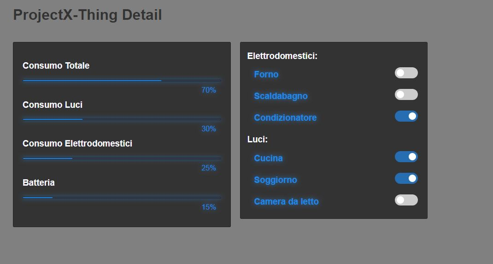

# Thing-Detail
Thing-Detail
Per poter visualizzare il progetto, aprire la pagina dromotic_object.html situata nella cartella code.
La pagina mostra al lato sinistro i principali valori da mostrare durante l'esecuzione del drone e al destro la selezione della categoria (tasto sinistro per visualizzare il valore delle luci, tasto destro per visualizzare i valori degli elettrodomestici)

